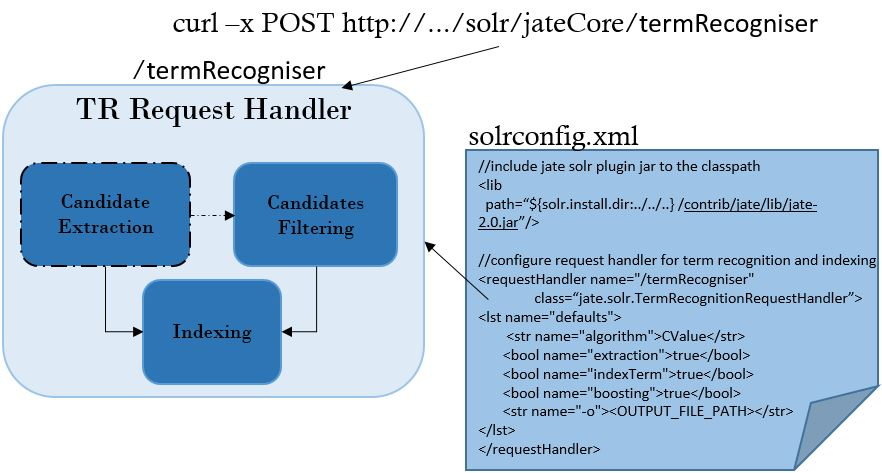

# jateSolrPluginDemo
Demo source code for presenting [JATE2.0] as content analysis tool in LREC 2016

# Overview of JATE2.0 plugin mode

The JATE2.0 plugin mode is designed to enable JATE2.0 to work as a Solr plugin. This mode makes it easy to scale up and down for different sizes of corpus and is recommended when users need to index new or enrich existing index with domain specific terminologies, which can, e.g., support faceted search, boost query. A custom request handler can support to process candidate term extraction, scoring, ranking, filtering, indexing and export by a simply HTTP request.

This demo is to demonstrate how JATE2.0 can be incorporated into Apache Solr as Content Analysis Tool. JATE2.0 are scalable, flexible and easy-to-use with your existing Solr engine. Just few steps of configuration with your Solr engine, you can fire off HTTP request to your Solr server. Hybrid search functionalities and faceted navigation are supported.



For more details of JATE2 and how to configure, please refer to the [JATE2.0 wiki].

# Demo implementation

This demo is developed based on [JATE2.0] and [Ajax Solr]. After Solr sever and JATE2.0 are properly setted up, the documents can be populated by using Solr [Post Tool]. After documents are indexed and stored in Solr server, there are two options to trigger term recognition with default setting provided. The first option is to simply fire off a POST request by cURL command line, e.g., ```curl -X POST http://localhost:8983/solr/jateCore/termRecogniser```. Alternatively, you can simply click the "Term Recognition" in the demo page (see pic below) to send a ajax request to the server. After "indexing and tagging" process is completed, the documents will be enriched with domain specific candidate terms to support faceted navigation and search. You can then index more documents or re-index with a different setting (e.g., different ATE algorithm, different threshold strategy, different PoS patterns) or click "Clean all" to index a new corpus for analysis.


# Installation

## Step 1. Download and Set up a release of [Apache Solr] (version > 5.x)

## Step 2. Download and Setup latest release of [JATE2.0]

To run the demo, you need to **1)** download and set up a release of [Apache Solr](version > 5.x); **2)** download and setup latest release of [JATE2.0].

# Configuration

The configuration of the demo can be divided into two parts, including Apache Solr with JATE2.0 plugin and ajax solr web demo.

## Apache Solr with JATE2.0 plugin

First, you need to set up Solr and JATE2.0 plugin. This assumes that you have the basic knowledge of Apache Solr and [solr plugin]. Please refer to [solr resources] for more solr documentations. For more details of setting up JATE2.0 plugin, please refer to the *Step 8* in [JATE2.0 Quick start].

This demo provides a default setting of core instance '*jateCore*'. Thus, briefly speaking, to make a quick start, you can simply make this work by 2-steps: 

1) place a JATE2.0 release into ```$<SOLR_HOME>/contrib/jate/lib```; 

2) copy '*jateCore*' into data directory of your Solr server

    A script named '*start_solr_server*' provides a example of setting to start your solr server with a custom *data directory* from command-line.

Note: Two important configurations files are **<jateCore>/conf/schema.xml** and **<jateCore>/conf/solrconfig.xml**.

## Ajax solr web demo

*It is recommended that you run solr with JATE2 plugin and check whether everything is setted up correctly.*

Next, you need to set up the ajax solr web front-end for the terminologies-driven faceted search and navigation. With default setting of '*Apache Solr with JATE2.0 plugin*' (Step 1), you can simply configure two settings in **'config.js'**: 1) Solr core URL; 2) term Recognition Service URL (i.e., JATE2.0 solr request handler).

# How to run

After few simply settings introduced above, you need to:

1) First, start your solr server by using ```start_solr_server.sh``` from command-line; 

2) next, using ```index_local_directory.sh``` to index your local documents from command-line; 

3) then, you can simply open ```home.html``` (Alternatively, if you deploy '*JATE2-Web-Demo*' into your favorite HTTP server(e.g., Apache Tomcat), you can simply request ```http://<SERVER_HOST>:<SERVER_PORT>/JATE2-Web-Demo```.

You can clean your index by clicking '*Clean all*' button for preparing for a different corpus. You can always populate new documents and simply click '*Term Recognition*' button to re-index your corpus. You can also change a different ATE algorithm or thresholds (in 'solrconfig.xml'), which needs a 'restart' or 'reload' your core. Then, you can perform term recognition again and try out the hybrid search functionalities.

# Live demo

A live demo is up and running during the LREC 2016 conference (between 23rd May and 29th May).

## Demo page for knowledge retrieval

```
http://oakanalysis.shef.ac.uk:8090/JATE2-Web-Demo
```

## Demo setting of Apache Solr

You may looking into JATE2.0 setting in Apache Solr server, e.g., by 'Schema Browser'. You can also try out how content will be extracted into candidate terms with 'jate_cterms' by 'Analysis' tool.
```
http://oakanalysis.shef.ac.uk:8983/solr/#/jateCore
```

**To cite JATE**: Zhang, Z., Gao, J., Ciravegna, F. 2016. JATE 2.0: Java Automatic Term Extraction with Apache Solr. To appear: Proceedings of the 10th Language Resources and Evaluation Conference, May 2016, Portorož, Slovenia

## Contact

If you have encountered with any problem, please feel free to contact us either via email or [JATE2.0 mailling list] available on [Google Groups].

<reference>

[JATE2.0]: <https://github.com/ziqizhang/jate>
[JATE2.0 wiki]: <https://github.com/ziqizhang/jate/wiki>
[Ajax Solr]: <https://github.com/evolvingweb/ajax-solr>
[Post Tool]: <https://cwiki.apache.org/confluence/display/solr/Post+Tool>
[Apache Solr]: <http://lucene.apache.org/solr/mirrors-solr-latest-redir.html>
[solr resources]: <http://lucene.apache.org/solr/resources.html>
[solr plugin]: <https://cwiki.apache.org/confluence/display/solr/Solr+Plugins>
[JATE2.0 Quick start]: <https://github.com/ziqizhang/jate/wiki/Quick-start>
JATE2.0 mailling list]: <https://groups.google.com/d/forum/jate2>